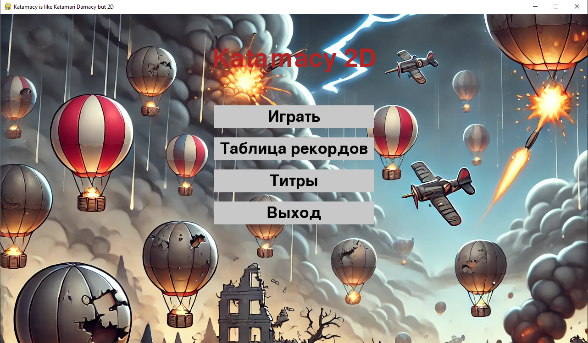
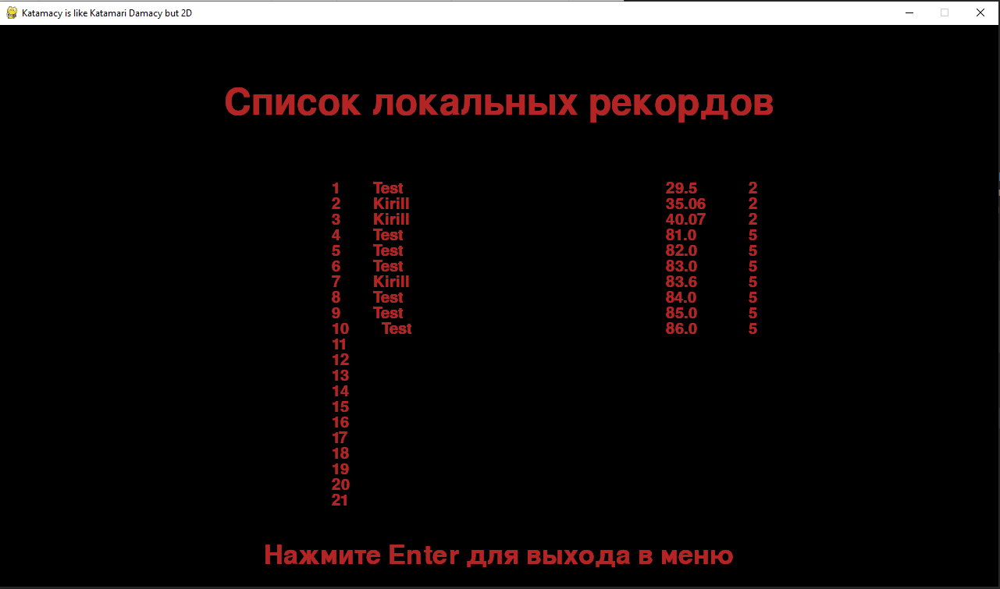
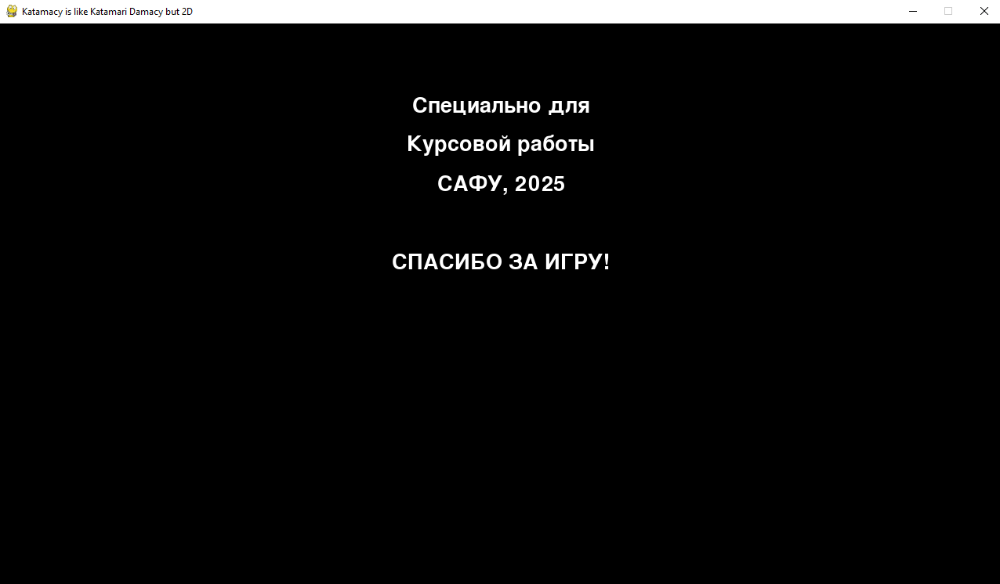

# 2D-Игра «Catamacy 2D» (Catamacy like Katamari Damacy but 2D)

Добро пожаловать в репозиторий нашей курсовой работы! Это 2D-игра, в которой игрок управляет шаром, который катится по карте, собирая различные объекты. В игре реализована уникальная механика роста шара: чем больше объектов он соберёт, тем больше становится его размер.

## Возможности игры

- **Тайловая карта**: Генерация карты из тайлов с различными текстурами (трава, песок, камень).
- **Механика роста**: Шар увеличивается в размере, собирая объекты, которые меньше его.
- **Препятствия и бонусы**: Игрок должен избегать препятствий и собирать бонусные объекты, чтобы получить дополнительные очки.
- **Уровни сложности**: Несколько уровней сложности, влияющих на размер и расположение объектов на карте.
- **Рекорды**: Таблица рекордов для самых успешных игроков.
- **Красивый интерфейс**: Простое и интуитивно понятное меню.
- **Эффекты**: Визуальные эффекты, такие как затемнение на карте, добавляющие атмосферности.

## Установка

Клонируйте репозиторий и запустите игру:
   ```bash
   git clone https://github.com/Casionale/kursovaya1.git
   pip install -r requirements.txt
   python main.py
   ```
## Управление

    W, A, S, D : Управление шаром.
    Esc и Enter: Выход в меню.


# Скриншоты
## Главный экран игры


# Игровой процесс


# Таблица рекордов



# Титры

# Технические особенности

Игра написана на Python с использованием библиотеки pygame. Карта генерируется случайным образом, что делает каждую игру уникальной. Система записи рекордов реализована с использованием SQLAlchemy. Эффекты дымки добавлены через использование прозрачности pygame.Surface.
Архитектура проекта

Проект состоит из следующих **основных** модулей:

    main.py: основной файл запуска игры.
    objects.py: содержит описание игровых объектов.
    ui.py: отвечает за пользовательский интерфейс.
    settings.py: хранит конфигурацию игры, пути к ресурсам и параметры.
    tilemap.py: отвечает за генерацию и отрисовку карты.

# Благодарности

Спасибо всем, кто помогал с разработкой этой игры, а также нашим преподавателям за ценные советы и рекомендации!
